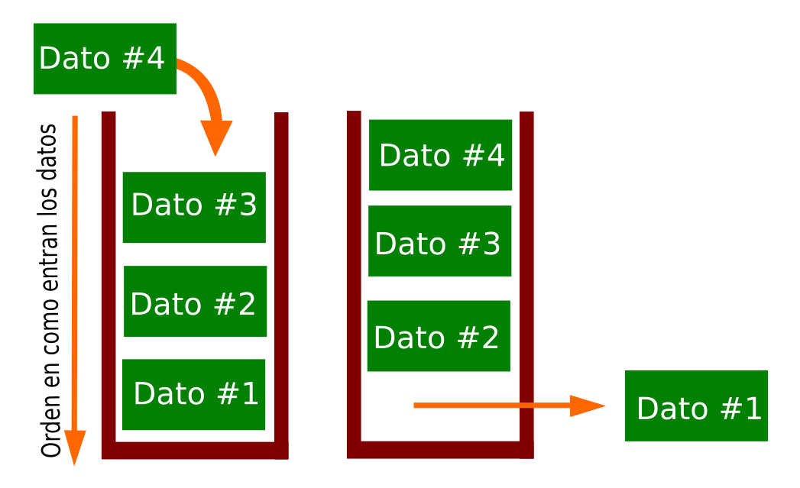

# ¿Qué es una estructura de datos?

La estrucutura de datos en informática es una forma particular de organizar los datos dentro de un ordenado, de tal fomra que este sea mas eficiente al hacer algun tipo de consultas en bases de datos y servicios de indización de Internet. Por lo general, las estructuras de datos eficientes son clave para diseñar algoritmos eficientes. Las estructuras de datos se basan generalmente en la capacidad de un ordenador para recuperar y almacenar datos en cualquier lugar de su memoria.

## Arrays

Un array es un medio de guardar un conjunto de objetos de la misma clase. Se accede a cada elemento individual del array mediante un número entero denominado índice. 0 es el índice del primer elemento y n-1 es el índice del último elemento, siendo n, la dimensión del array. Ejemplo:

```C++
#include <stdio.h>
int main(){
int v[] = {3,5,8,7,9};
prinft("El valor de la posición 2 es: %i\n", v[2] );
}
```

Donde como se puede observar en la **línea 3**, declaramos un array con datos del tipo entero, siendo en la **línea 4** la impresión del valor "2" guardado en el array, el cúal es el número 8.

## Matrices como arreglos de arreglos

Este tipo de arreglos son conocidos como matrices y pueden almacenar muchos más datos que los arreglos unidimensionales, los bidimensionales se componen de n filas por m columnas. Eljemplo:

```C++
#include <stdio.h>
int main(){
int numeros[2][3] = {{1,2,3},{3,4,5}}; //Matriz de tipo entero de 2 x 3
}
```
**Presentación de matriz 2 x 3**
```C++
1 2 3
3 4 5
```
## Listas Ligadas (linked lists)

Las listas enlazadas en C son estructuras de datos que enlazan los elementos mediante un puntero. Son semejantes a los array salvo que el acceso a un dato (de tipo entero, carácter, flotante, etc) no se hace mediante un índice. También tienen una estructura dinámica, es decir, que no necesitamos conocer con anterioridad el número de elementos que va a contener.

Para establecer un elemento de la lista será utilizado el tipo **struct**. El elemento de la lista tendrá un campo dato y un puntero. El puntero tiene que ser del mismo tipo que el elemento. De lo contrario, no podrá apuntar hacia el elemento. Ejemplo:

```C++
typedef struct ElementoLista {
char *dato;
struct ElementoLista *siguiente;
}Elemento;
```
## Árboles (trees)

Los árboles (trees) son una estructura de datos, que se define de forma recursiva como una colección de nodos, empezando por un nodo raíz, donde cada nodo es una estructura de datos que contiene un valor, y opcionalmente una lista de referencias a otros nodos, con la limitación de que ninguna referencia esté duplicada, y que ninguna apunte al nodo raíz.

**Implementación**

## Tries

Un **trie** es una estructura de datos de tipo árbol que permite la recuperación de información. La información almacenada en un trie es un conjunto de claves. Las claves son almacenadas en las hojas del árbol y los nodos internos son pasarelas para guiar la búsqueda. El árbol se estructura de forma que cada letra de la clave se sitúa en un nodo de forma que los hijos de un nodo representan las distintas posibilidades de símbolos diferentes que pueden continuar al símbolo representado por el nodo padre. Por tanto la búsqueda en un trie se hace de forma similar a como se hacen las búsquedas en un diccionario.

## Tablas hash (hash tables)

Las Tablas Hash son estructuras de datos no lineales que utilizan un arreglo lineal para almacenar sus elementos.

La  función Hash de una Tabla Hash convierte un dato del elemento a almacenar, conocido como clave, en un entero entre 0 y n-1 que representa un índice dentro del arreglo de la estructura, que posee "n" elementos.

La principal aplicación de las Tablas Hash es el diseño de diccionarios, pero bien pueden ser utilizadas en un sin fin de tareas donde la velocidad de las búsquedas sea siempre un punto crítico en el proceso de desarrollo.

## Colas (queues)

Una Cola o Queue es una estructura de datos que sigue la Filosofía **FIFO** del ingles **First In – First Out** que en español seria **“Primero en entrar primero en salir”**. Esto quiere decir que el elemento que entre primero a la Cola sera el primero que salga y el último que entre sera el último en salir.



**Fuentes**

- https://docs.microsoft.com/es-es/powershell/scripting/learn/deep-dives/everything-about-hashtable?view=powershell-7.1

- http://www.sc.ehu.es/sbweb/fisica/cursoJava/fundamentos/clases1/arrays.htm

- https://developer.mozilla.org/

- https://codigosdeprogramacion.com/cursos/?lesson=8-arreglos-y-matrices

- https://es.ccm.net/faq/2842-la-lista-enlazada-simple

- https://medium.com/laboratoria-developers/%C3%A1rboles-trees-51783ba4ebe5

- http://www.utm.mx/~dtorres/cursos/estructuradedatos/Tema6-Arboles.pdf

- https://www.oscarblancarteblog.com/2014/08/01/estructura-de-datos-queue-cola/
